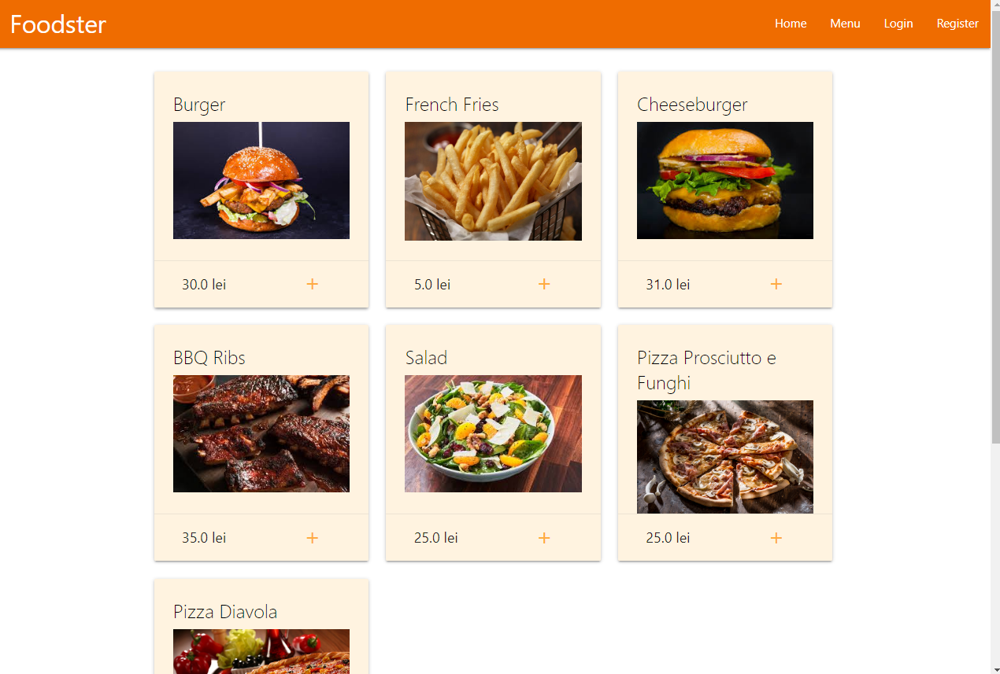
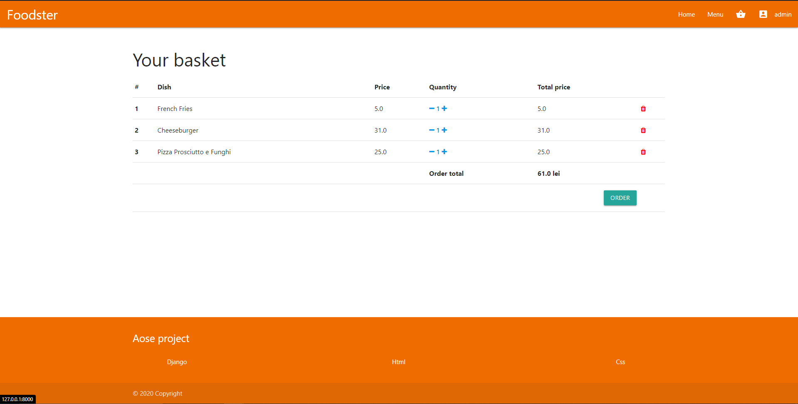
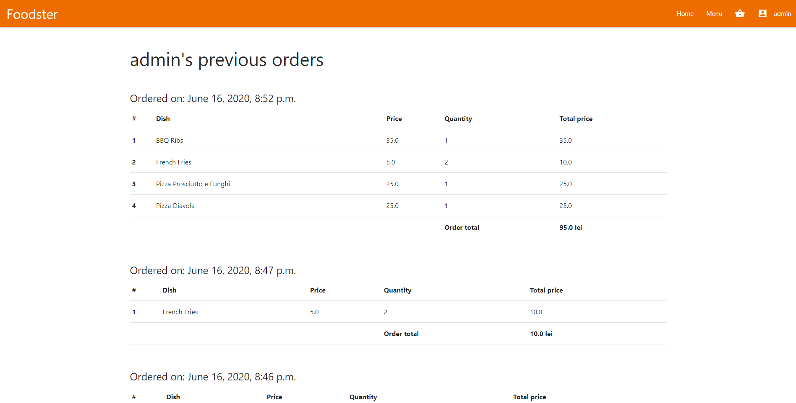

# Foodster 

Food delivery application with Django. Responsive design implemented with Materialize css.  

## Start django server to try application with: 
~~~
python manage.py runserver
~~~

## Database management
In order to use the database management tool, you can add "/admin" after the root app url (requires admin account login)

## Example of menu page

## Basket example

## Orders history example
